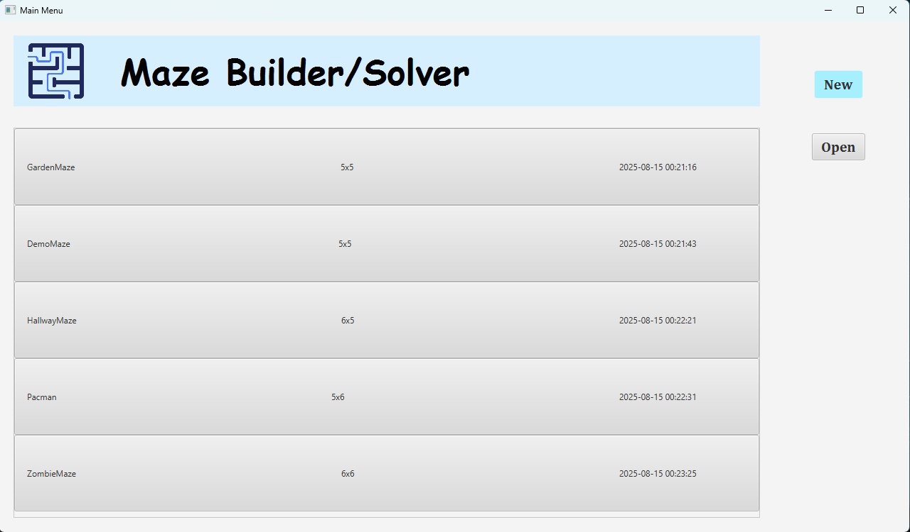
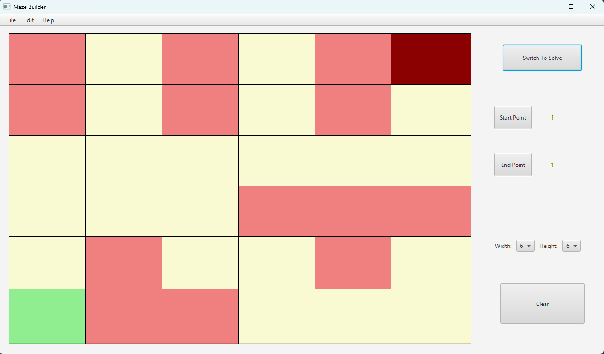
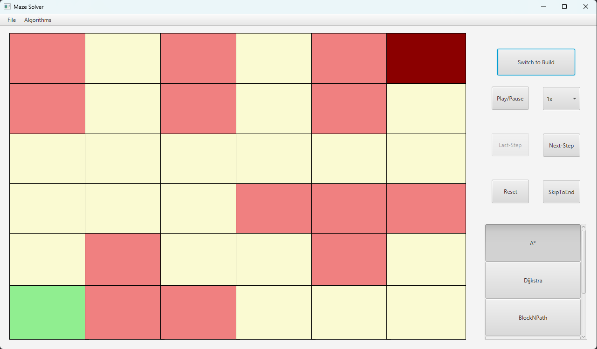
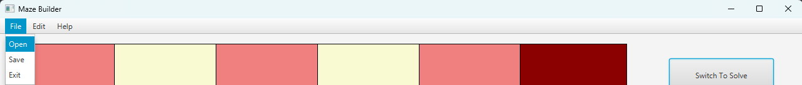
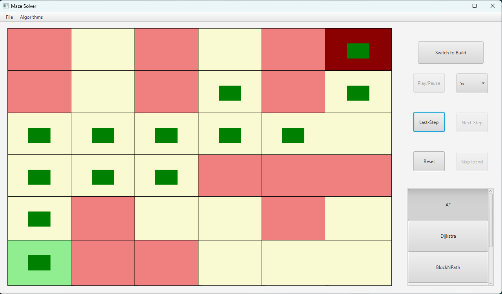
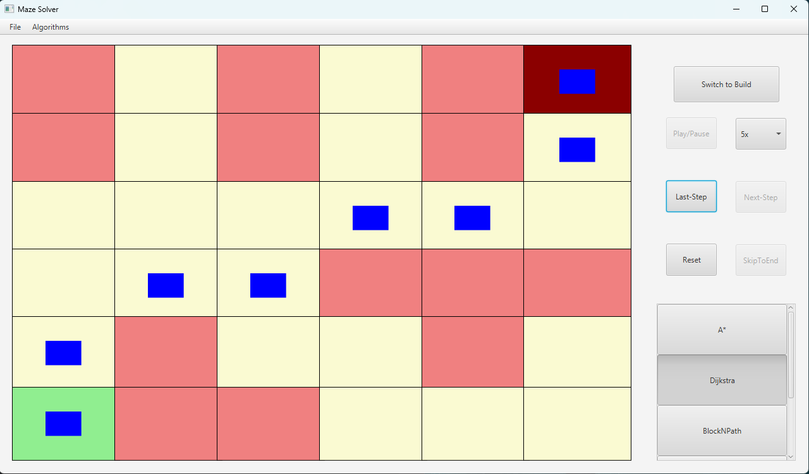
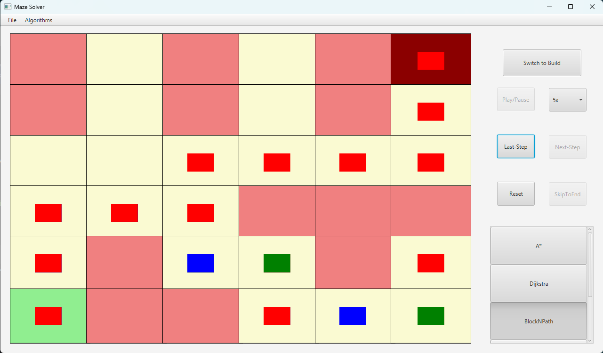
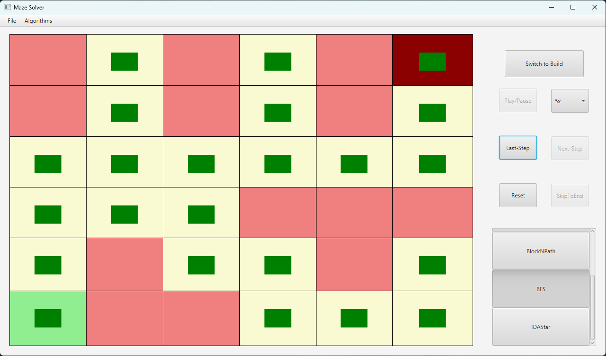
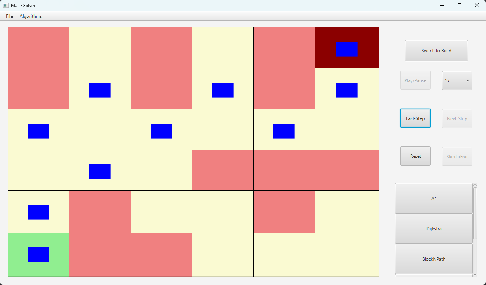

# Maze Builder and Solver App
### A JavaFX based desktop application that allows you to create, customize, and solve mazes using various pathfinding algorthims.

## How it Works
Maze Builder & Solver is an interactive JavaFX application that allows users to create, customize, and solve mazes using classic pathfinding algorithms. 
It features a user-friendly interface for painting walls, setting start and end points, and visualizing algorithm steps in real time.
Users can switch between algorithms, adjust animation speed, and save or load mazes via a local SQLite database. 

All pathfinding algorithms in this project are implemented in C++ to maximize performance, while all UI logic, event handling, and database operations are managed in Java. 
The application uses the JavaFX toolkit with FXML for structuring the visual layout, and applies CSS for styling and theme customization.

### 🖼️ Application Views

The Maze Builder & Solver app is split into clearly defined views, each focused on a specific part of the user workflow:

- **🏠 Main Menu**  
  The entry point of the application. Lets users choose between building a new maze or solving an existing one. Also displays basic instructions and navigation tips.




- **🧱 Builder View**  
  Allows users to draw mazes by painting walls and paths, place start/end points, and adjust the maze dimensions. Includes file options for saving and loading mazes to/from the database.



- **🔍 Solver View**  
  Displays available pathfinding algorithms and lets users visualize them in real-time. Includes controls for algorithm selection, playback speed, and stepping through the solution.



- **⚙️ Top Menu Bar**  
  Shared across views, this provides options like loading/saving mazes, switching themes, clearing the grid, or exiting the application. Built using JavaFX’s `MenuBar` and styled via CSS.




### 🧠 Supported Algorithms

The following pathfinding algorithms are supported in the Maze Solver. Each can be visualized step-by-step as they explore the maze:

- **A\* Algorithm**  
  An informed search algorithm that uses a heuristic (like Manhattan distance) to prioritize paths that are likely to reach the goal faster. Usually finds the shortest path efficiently.


- **Dijkstra’s Algorithm**  
  Finds the shortest paths from a start node to all other nodes in a weighted graph with non-negative edges. Uses a priority queue to always expand the node with the smallest known distance, ensuring optimal paths.


- **Recursive Backtracker Algorithm (Custom)**  
  A custom search algorithm created by both contributors that recursively explores each direction in a fixed order. It backtracks on dead ends and can be adapted for maze generation or solving.


- **Breadth-First Search Algorithm (BFS)**  
  Explores the maze level by level, guaranteeing the shortest path in an unweighted grid. Uses a queue to process nodes in order of distance from the start.


- **Iterative Deepening A\* Algorithm (IDA\*)**  
  Combines the depth-limited search of DFS with A\*'s heuristic guidance. It uses iterative deepening to reduce memory usage while still aiming for optimal paths.


## How to run

1. Clone the Repo

```bash
git clone https://github.com/Pawanjot-Randhawa/Maze-BuilderSolver.git
```

2. Run the make powershell script
```powershell
./make.ps1
```
